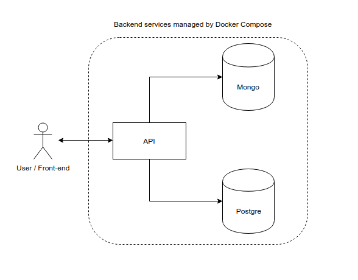

# Debugging TypeScript using Docker containers and VSCode

#### Prerequisites

There are some things that should be installed before we get started:

- Docker
- Node JS
- Visual Studio Code (a.k.a VS Code)


#### Keywords

- **Host** - this is your computer where you are working. In computer networking terms (roughly saying), it is a computer that communicates with other computers.
- **Docker image** - the set of layers/instructions you describe to run (it is more like a sequence, where the order of commands matter).
- **Docker container** - instance of your **image**. Roughly saying, it is like an instance of some "class" (OOP).

### Getting Started 

Clone this project and let's get started!

### It all starts with *npm init*

Imagine that you are working on a computer where Node.js is not installed. One way to proceed with initialization of your project is to install Node.js locally using your package manager (e.g. apt) and then proceed with `npm init`. However, there is a cooler, more portable, and more cross-platform way of doing this; where, no version conflicts occur, no manual explicit configurations are needed to be set up with changing OS environment, etc. In other words, ~~heaven~~ Docker!

Docker is a container management service. The keywords of Docker are **develop**, **ship** and **run** anywhere. The whole idea of Docker is for developers to easily develop applications, ship them into containers which can then be deployed anywhere. What a brilliant and lovely idea for the DevOps workflow. I assume you have latest Docker installed. Docker uses images (check the definition above) to run containers which are, roughly saying, isolated processes that share the same OS kernel. Note that that Docker containers are **NOT** magical, lightweight VMs! If you are interested how Docker Containers work behind the scenes, [here you go! (Talk given by Jérôme Petazzoni at DockerCon EU)](https://www.youtube.com/watch?v=sK5i-N34im8)


Let's initialize our project by using the latest Node.js image. The following command runs an interactive bash terminal, which lets us access the container with Node.js installed in it, and binds a current directory of the host to the `/app` directory in the container, which lets us persist our files (e.g. package.json, etc.).

`docker run -it -v $(pwd):/app node /bin/bash`

You will immediately notice that your terminal's hostname has changed to something like `root@b95028b5a79c:/#`. Congrats! Now, you are in a container with Node.js present inside! How cool is that, huh? :)

Now, in order to access our files and initialize the project, open the `/app` folder and run `npm init`:

```bash
cd /app     # opens app folder
npm init    # initialize the Node.js project (creates a package.json)
```

You can also run `ls` command to see what's in the current directory. You will see that you have everything there from the current directory of the host.

Now run `exit` to exit from the container. Since you have attached a volume using a `-v` option when running a container, your package.json could be seen in your current directory in the host.

Congratulations! So far, you have managed to initialize a Node.js project using Docker (images and running containers) without actually installing Node.js in your computer. It is quite lovely, isn't it?

### Dockerfile and docker-compose

If your app uses 2 database services, e.g. MongoDB and PostgreSQL, and you have Node.js API running which interacts with those DBs, then you already have at least 3 services. If you want to dockerize your multi-service application, then you have to define 3 images for those services using Dockerfiles (one per service).

Docker-compose is another Docker tool which lets us manage multi-container applications. With Docker-compose, it is simpler to manage and scale your services. Docker-compose works almost the same way as the `docker` command; instead of providing a Dockerfile, you can configure your services by creating the `docker-compose.yml` file. Though in a bit different way, you can configure the same way as in a Dockerfile: mounting volumes, running commands, getting images.



For instance, take a look at the image above. We can define a single Dockerfile for the API, and just use latest images for Mongo and Postgre. Why don't we create Dockerfiles for these? Indeed, you could create a Dockerfile for each of those and configure your DB services with them. However, in this case, we don't need to configure anything, we just need the DBs services running in the respective containers. 

**NOTE:** We would use Dockerfile for the Node.js API service because we have to **build** the app first, i.e. install its dependencies, transpile (if we use Typescript, etc.). This is how Dockerfile for the Node.js would look like:

```dockerfile
# use Node.js version latest
FROM node

# create app folder in the container (not the host)
RUN mkdir -p /app       

# sets the working directory inside the container (where RUN/CMD commands will be executed)
WORKDIR /app

# copies everything from the current directory into the /app folder inside the container (COPY <host_dir> <container_dir>)
COPY package.json /app

# runs "npm install" command inside the container
RUN ["npm", "install"]

# copy the node_modules and the rest of the files into /app
COPY . /app
```

So, what have we done? We wrote a sequence of instructions which defines your image. We pulled Node (version 9) from the [Docker Hub](https://docs.docker.com/docker-hub/repos/), created a directory `/app` inside the container, we "told" Docker to work with the `/app` directory, and copied everything (i.e. package.json, src folders, readme, etc.) from the **current folder of the host machine** into the **`/app` folder in the container**. And, ultimately, we ran the `npm install` command inside the container, so we get the dependencies from the package.json installed.

Now, let's create the `docker-compose.yml` file where we will define set the configurations (env variables, volumes, networks, etc.) for the services in our architecture. **Note** that here we are not going to define a Postgre service, just Mongo and Node.js API. Here is an example of how to define these:

```yaml
version: "3"          # use version Compose version 3
services:             # our services 
  api:
    build: .          # use Dockerfile from current directory at build time
    volumes:          # volumes are there to let us persist data when containers are exited
      - .:/app        # bind a current directory of the host to the /app directory in the container
    depends_on:
      - database      # not started until "example-mongo" service is started
    networks:         # let's us be discoverable and reachable by other services in the same network
      - api-net       # join "api-net" network
    ports:
      - 3000:3000     # bind port 3000 on host to port 3000 on container
    command: npm run start  # execute the following command when the image is running, e.g. run the Node server
    
  database:
    image: mongo      # if tag is not specified, gets latest image (e.g. MongoDB image)
    environment:
      - MONGO_INITDB_ROOT_USERNAME=admin      # set the root username to "admin"
      - MONGO_INITDB_ROOT_PASSWORD=admin123   # set the root password to "admin123"
    volumes:
      - ./data:/data/db   # persist data from mongodb
    networks:
      - api-net       # makes "database" reachable (via hostname) by other services in the same network
    ports:
      - "27017:27017" # bind port
```

Note that you could leverage *links* as well, though I personally love *networks* because of their simplicity: you can reach other services in the same network just by using their service name (in our case, they are `api` or `database`). One could also define `working directory` inside the compose file (by using `working_dir` field) instead of specifying it in the Dockerfile.

For more details on Docker Compose, I would recommend the following [Compose file Reference](https://docs.docker.com/compose/compose-file/)

### Typescript and Node.js

Typescript is a programming language that brings us an optional static type-checking and latest ECMAScript features. By using Typescript, you can leverage the power of OOP, i.e. interfaces, classes, inheritance, polymorphism etc. I would personally recommend to everyone, especially to those who come from the Java/C# side and are just starting out with Javascript. `.ts` files are compiled to `.js` files, meaning that Typescript is compiled to Javascript. So, in the end, you end up with Javascript anyway :)

In order to get started with Typescript, we have to install `typescript` module via npm. We can do this by running our Node container again. Do not forget to attach a volume so the change in package.json is actually saved on our host:

```bash
docker run -it -v $(pwd):/app node /bin/bash    # access the Node container
cd /app                                         # get into /app folder
npm install typescript --save-dev               # install and save as development dependency
```

At the same time, let's install `express` and the type for it to run the Express server! **Note** that I will not be using MongoDB in this case (though you should experiment and try yourself!). 

```bash
npm install express --save
npm install @types/express --save-dev
exit        # exit the container
```

As there is already some boilerplate code defined in `src/server.ts` file, let's change the package.json so that we first compile the code from TS to JS, and then run it! **Make sure you are out of the container.**

```json
"build": "tsc",   /* Transpile to JS  */
"start": "npm run build && node ./dist/server.js"  /* Start the server */
```

We also need to create a `tsconfig.json` file that configures the Typescript compiler. More details on TS compilation configurations, check [this link](https://github.com/Microsoft/TypeScript-Node-Starter#typescript-node-starter) out. Here is our example:

```json
{
    "compileOnSave": true,
    "compilerOptions": {
        "outDir": "dist",
        "module": "commonjs",
        "target": "es6",
        "noImplicitAny": true,
        "moduleResolution": "node",
        "sourceMap": true,
        "baseUrl": ".",
        "skipLibCheck": true,
        "paths": {
            "*": [
                "node_modules/*",
                "/src/types/*"
            ]
        }
    },
    // includes all typescript files
    "include": [
        "./src/**/*.ts",
    ],
    // excludes the folder containing the compiled JS files 
    "exclude": [ "./dist"]
}
``` 

Now, let's create a `docker-compose.yml` file with which we will run a Node.js server. Here, we will not use a Dockerfile; we will instead configure the API service straight in the Compose yaml file.

```yaml
version: "3"          # use version Compose version 3
services:             # our services 
  api:
    image: node       # use latest node image
    working_dir: /app # set the working directory to /app
    volumes:          # volumes are there to let us persist data when containers are exited
      - .:/app        # bind a current directory of the host to the /app directory in the container
    ports:
      - 3000:3000     # bind port 3000 on host to port 3000 on container
    command: "npm run start"
```

Before running the container, we have to install our dependencies. You may not have Node.js in your computer, or you may have a different version (which may cause you some good ERRs), so let's run a Node container (of latest version) and install our dependencies (do not forget to attach a volume):

```bash
docker run -it -v $(pwd):/app node /bin/bash
# we are inside the container
npm install
exit 
```

To run the actual service, type the following command (the `-f` option specifies the file to run) to run the server:

```bash
docker-compose -f docker-compose.yml up
```

**Note if you are getting ERROR:** If you are getting the `ERROR: Error processing tar file(exit status 1): unexpected EOF`, run the following commands:

```bash
cd ..       # get out to the parent directory 
sudo chown -R $(whoami) nodejs-debugging/  # this gives you and Docker the rights to the nodejs-debugging folder
```

If you see `Listening on port 3000!` message, yay! Open a browser and type `localhost:3000`, and you will see the server is up. You can also try opening the routes, i.e. `/greet` and `/time`.

### Debugging with Virtual Studio Code

Visual Studio Code (VS Code) has a built-in debugging support for Node.js runtime and can debug any languages that are transpiled to JavaScript.

Since the VS Code Node.js debugger communicates to the Node.js runtimes through wire protocols, the set of supported runtimes is determined by all runtimes supporting the wire protocols:

- **legacy:** the original [V8 Debugger Protocol](https://github.com/buggerjs/bugger-v8-client/blob/master/PROTOCOL.md) which is currently supported by older runtimes.
- **inspector:** the new [V8 Inspector Protocol](https://chromedevtools.github.io/debugger-protocol-viewer/v8/) is exposed via the `--inspect flag` in Node.js versions >= 6.3. It addresses most of the limitations and scalability issues of the legacy protocol.

As we are running a server from a Docker container, we have to attach a *remote* debugger. We need to add a **launch configuration** to the `.vscode` folder, i.e. `launch.json`. Here is an example of the launch configuration file: 

```json
{
    "version": "0.2.0",
    "configurations": [
        {
            "type": "node",
            "request": "attach",
            "name": "Remote Debugging",
            "address": "0.0.0.0",
            "port": 9229,
            "localRoot": "${workspaceFolder}/dist",
            "remoteRoot": "/app/dist",
            "protocol":"inspector"
        }
    ]
}
```

We set a *remote root* to be path in the container, where our program lives.

Now, in order to add remote debugging, we have to add another script to package.json:

```json
"debug": "npm run build && node --inspect-brk=0.0.0.0:9229 ./dist/server.js"
```

The `debug` script will build (i.e. transpile the TS code) project and will start Node runtime in debugging mode accessible remotely on port `9229` (remember the port we specified above?).

Let's create another Compose file, which we will use for running the server in the debug mode:

```yaml
version: "3"          # use version Compose version 3
services:             # our services 
  api:
    image: node       # use latest node image
    working_dir: /app # set the working directory to /app
    volumes:          # volumes are there to let us persist data when containers are exited
      - .:/app        # bind a current directory of the host to the /app directory in the container
    ports:
      - 3000:3000     # bind port 3000 on host to port 3000 on container
      - 9229:9229     # bind port 9229 for debugging
    command: "npm run debug"
```

The only differences are that we are now running in **debug mode** and we attached extra **port for debugging (9229)**. 

Type the following command in the terminal so you can run the debug server:

```bash
docker-compose -f docker-compose.debug.yml up
```

And you will see the following message

> api_1  | Debugger listening on ws://0.0.0.0:9229/f3cdf4f2-4685-21e6-8c31

Yay! Now, as the debugger is listening on `0.0.0.0:9229`, we have to start debugging via VS Code. If you click `CTRL + SHIFT + D` keys, the "debug" mode will open. You will see the "Remote Debugging" slider upper-left corner and the button (looks like green triangle). E.g.:


Be courageous and click on the green triangle button. Congratulations! You have just started debugging your app using VS Code and Docker containers! It's a long markdown to read; anyway, you learnt something new which will help you a lot debugging your Node.js apps and become a better developer!


Thank you for reading the tutorial! Constructive feedback is always welcome via *issues* on this repo.

**PS.** If something does not work, or if you have any problems, please open an issue in this repo and I will do my best to help you asap.

### References

- [Node.js Debugging in VS Code](https://code.visualstudio.com/docs/nodejs/nodejs-debugging)
- [Debugging TypeScript in a Docker Container](https://github.com/Microsoft/vscode-recipes/tree/master/Docker-TypeScript)
- [Docker - Compose](https://www.tutorialspoint.com/docker/docker_compose.htm)