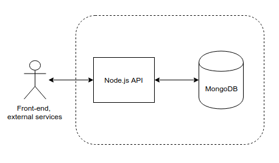

# Debugging TypeScript using Docker containers and VSCode

Visual Studio Code (VS Code) has a built-in debugging support for Node.js runtime and can debug any languages that are transpiled to JavaScript.

Since the VS Code Node.js debugger communicates to the Node.js runtimes through wire protocols, the set of supported runtimes is determined by all runtimes supporting the wire protocols:

- **legacy:** the original [V8 Debugger Protocol](https://github.com/buggerjs/bugger-v8-client/blob/master/PROTOCOL.md) which is currently supported by older runtimes.
- **inspector:** the new [V8 Inspector Protocol](https://chromedevtools.github.io/debugger-protocol-viewer/v8/) is exposed via the `--inspect flag` in Node.js versions >= 6.3. It addresses most of the limitations and scalability issues of the legacy protocol.


### Prerequisites

There are some things that should be installed before we get started:

- Docker
- Node JS
- Visual Studio Code (a.k.a VS Code)

**NOTE:** I would suggest you have Docker installed on a Linux machine such as Arch or Ubuntu. 

### Keywords

- **Host** - this is your computer where you are working. In computer networking terms (roughly saying), it is a computer that communicates with other computers.
- **Docker image** - the set of layers/instructions you describe to run (it is more like a sequence, where the order of commands matter).
- **Docker container** - instance of your **image**. Roughly saying, it is like an instance of some "class" (OOP).

### Getting Started 

#### It all starts with *npm init*

Imagine that you are working on a computer where Node.js is not installed. One way to proceed with initialization of your project is to install Node.js locally using your package manager (e.g. apt) and then proceed with `npm init`. However, there is a cooler, more flexible, portable, and more cross-platform way of doing this; where, no version conflicts occur, no manual explicit configurations are needed to be set up with every changing user environment, etc. In other words, heaven! It is fun, it will make you cry, it will make you happy. It is called Docker! 

Docker is a container management service. The keywords of Docker are **develop**, **ship** and **run** anywhere. The whole idea of Docker is for developers to easily develop applications, ship them into containers which can then be deployed anywhere. What a brilliant and lovely idea for the DevOps workflow. I assume you have latest Docker installed. Docker uses images (check the definition above) to run containers which are, roughly saying, isolated processes that share the same OS kernel. Note that that Docker containers are **NOT** magical, lightweight VMs! If you are interested how Docker Containers work behind the scenes, [here you go! (Talk at DockerCon EU)](https://www.youtube.com/watch?v=sK5i-N34im8)


#### Docker-compose

For example, if your app uses 2 database services, e.g. MongoDB and PostgreSQL, and you have Node.js API running which interacts with those DBs, then you already have at least 3 services. If you want to dockerize your multi-service application, then you have to define 3 images for those services using Dockerfiles (one per service).

Docker-compose is another Docker tool which lets us manage multi-container applications. With Docker-compose, it is simpler to manage and scale your services. Docker-compose works almost the same way as the `docker` command; instead of providing Dockerfile, you can configure your services by creating the `docker-compose.yml` file. Though in a bit different way, you can configure the same stuff as in the Dockerfile: mounting volumes, running commands, getting images.



For instance, for the architecture in the image above, we can define a single Dockerfile for the API, and just use latest images for Mongo and Postgre. Why not Dockerfiles for each? Indeed, you could create a Dockerfile for each of those and configure your DB services with them. However, in this case, we don't need to configure anything, we just need the DBs services running in the respective containers. 

**NOTE:** We would use Dockerfile for the Node.js API service because we have to **build** the app first, i.e. install its dependencies, transpile (if we use Typescript, etc.). This is how Dockerfile for the Node.js would look like:

```dockerfile
# use Node.js version 9
FROM node:9

# create app folder in the container (not the host)
RUN mkdir -p /app

# sets the working directory inside the container (where RUN/CMD commands will be executed)
WORKDIR /app

# copies everything from the current directory into the /app folder inside the container (COPY <host_dir> <container_dir>)
COPY . /app

# runs "npm install" command inside the container
RUN ["npm", "install"]  
```

So, what have we done? We wrote a sequence of instructions which defines your image. We pulled Node (version 9) from the [Docker Hub](https://docs.docker.com/docker-hub/repos/), created a directory `/app` inside the container, we "told" Docker to work with the `/app` directory, and copied everything (i.e. package.json, src folders, readme, etc.) from the **current folder of the host machine** into the **`/app` folder in the container**. And, ultimately, we ran the `npm install` command inside the container, so we get the dependencies from the package.json installed.

Now, let's create the `docker-compose.yml` file where we will set the configurations (env variables, volumes, etc.) for our containers.

- First, dockerize / docker-compose
- Second, do npm in container, files locally, put files in the container
- Third, configure package.json and VS Code remote debugger


**1.** Let's initialize our project using `npm init` so we get ```package.json``` created (unless you already have project/app initialized). The ```package.json``` file is the standard file for ```npm``` package management (info about your app, dependencies with respective versions, etc.)

**2.** Unless you have your own Node.js code, check out the [server.ts](./src/server.ts) file in this repo. It basically 

### References

- [Node.js Debugging in VS Code](https://code.visualstudio.com/docs/nodejs/nodejs-debugging)
- [Debugging TypeScript in a Docker Container](https://github.com/Microsoft/vscode-recipes/tree/master/Docker-TypeScript)
- [Docker - Compose](https://www.tutorialspoint.com/docker/docker_compose.htm)